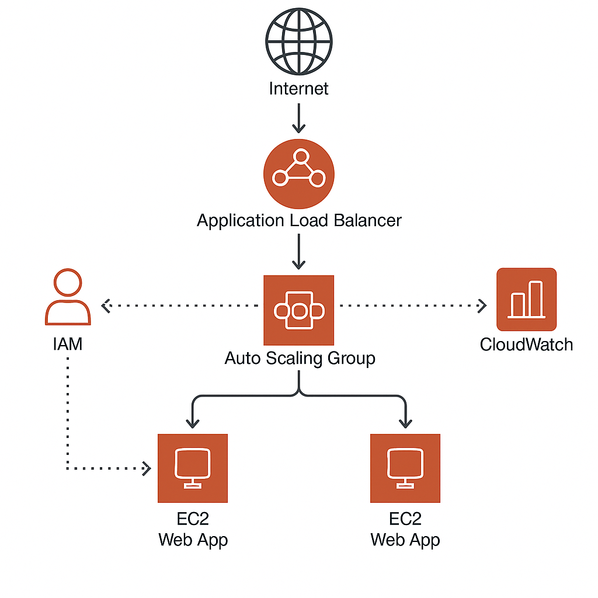

# **Project : Scalable Web Application with ALB and Auto Scaling**

## **Overview**

This project demonstrates how to deploy a scalable web application on AWS using EC2 instances, an Application Load Balancer (ALB), and an Auto Scaling Group (ASG). It follows AWS best practices for high availability, security, and cost optimization.

---

## **Architecture Diagram**

---

## **Key AWS Services**

- **Amazon EC2** – Hosts the web application  
- **Application Load Balancer (ALB)** – Distributes incoming traffic  
- **Auto Scaling Group (ASG)** – Adjusts EC2 instances based on demand  
- **IAM** – Manages secure access  
- **CloudWatch** – Monitors and triggers alerts  

---

## **Step-by-Step Deployment**

### ✅ **Step 1: Prerequisites**

- AWS Account  
- AWS CLI installed and configured  
- A key pair for EC2 login  
- IAM role with EC2, Auto Scaling, and ALB permissions  

---

###  **Step 2: Create Launch Template**

- Choose Amazon Linux or Ubuntu AMI  
- Select an instance type (e.g., t2.micro)  
- Add your key pair  
- Attach a security group (allow HTTP port 80)  
- Add User Data (startup script to install and run the app)  
- Attach IAM role  

---

### ⚙️ **Step 3: Create Auto Scaling Group (ASG)**

- Use the launch template created in Step 2  
- Choose multiple Availability Zones  
- Set minimum, maximum, and desired instance count  
- Configure health checks and scaling policies  

---

###  **Step 4: Create Application Load Balancer (ALB)**

- Internet-facing ALB  
- Listener on port 80 (add HTTPS if needed)  
- Create target group and register with ASG  
- Set up health check path (e.g., `/health`)  

---

###  **Step 5: Set Up Monitoring with CloudWatch**

- Create CloudWatch Alarms (e.g., CPU > 70%)  
- Attach alarms to ASG scaling policies  
- Optional: Create dashboards for real-time monitoring  

---

###  **Step 6: Test the Setup**

- Access the Load Balancer's DNS name in the browser  
- Scale traffic manually or use stress tools  
- Verify Auto Scaling and Load Balancing in action  

---

##  **Tips for Cost Optimization**

- Use EC2 Spot Instances or Savings Plans  
- Schedule downtime for non-critical environments  
- Use CloudWatch to identify underused resources  

---

##  **Security Best Practices**

- Use IAM roles for secure access to AWS resources  
- Restrict security groups to necessary ports  
- Keep EC2 AMIs updated  

---

## 📄 **License**

This project is licensed under the MIT License.
